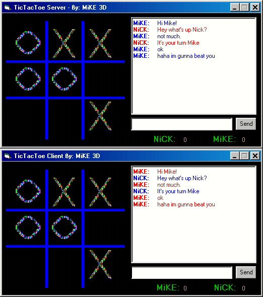



## Play TicTacToe over the Internet\!

### Description

I've seen other entries on this simple little game but I didn't see one that was playable over the internet using Microsoft's Winsock control so I decided to make this complete Game that would let you play someone on the Internet. This Game includes a little Chat Room(with color from Microsoft's RichText Control), a Score Keeper that will keep track of your score and your partner's score, plus more. Do what you want with this coding, add more options for the chat room or anything you can think of. This is perfect for all you programmers that want to make a simple game playable over the internet with the help of the Winsock Control. Good Luck   E-mail me at: mikecanejo@hotmail.com or AIM: Mike3dd  -Mike Canejo
 
### More Info
 

             |
---                |---
**Submitted On**   |2000-03-12 15:44:36
**By**             |[Michael L\. Canejo](https://github.com/Planet-Source-Code/PSCIndex/blob/master/ByAuthor/michael-l-canejo.md)
**Level**          |Intermediate
**User Rating**    |4.8 (24 globes from 5 users)
**Compatibility**  |VB 4\.0 \(32\-bit\), VB 5\.0, VB 6\.0
**Category**       |[Games](https://github.com/Planet-Source-Code/PSCIndex/blob/master/ByCategory/games__1-38.md)
**World**          |[Visual Basic](https://github.com/Planet-Source-Code/PSCIndex/blob/master/ByWorld/visual-basic.md)
**Archive File**   |[CODE\_UPLOAD39413122000\.zip](https://github.com/Planet-Source-Code/michael-l-canejo-play-tictactoe-over-the-internet__1-6305/archive/master.zip)

